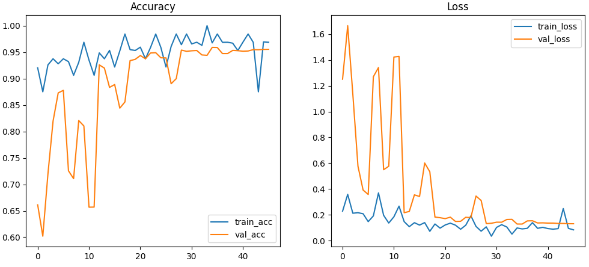
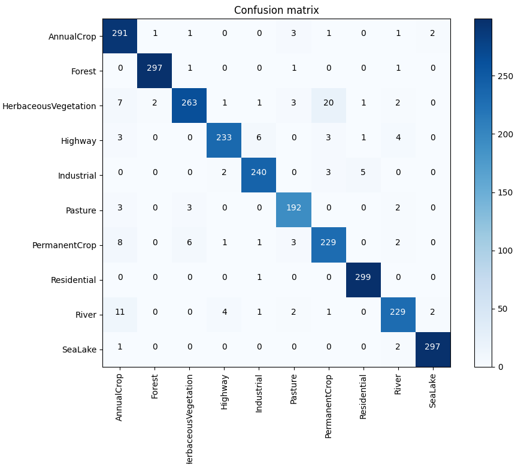
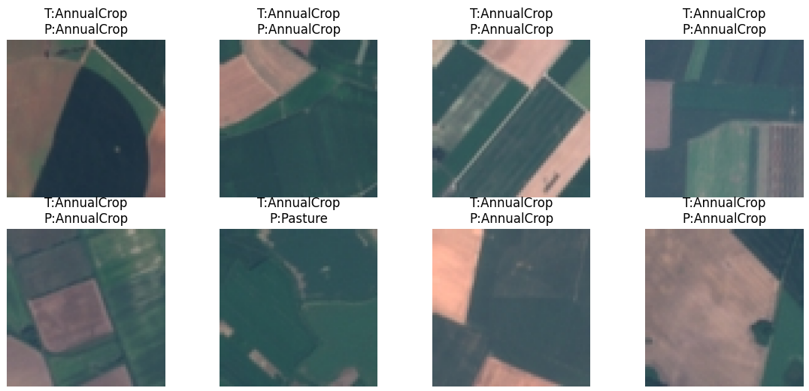
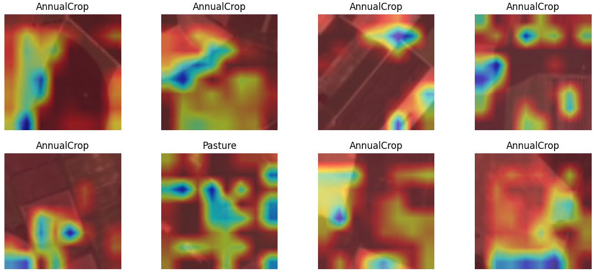

# EuroSAT Land Cover Classification using CNN with Residual Connections and Spatial Attention

## 📌 Google Colab Notebook

The full implementation of this project is available on Google Colab:

https://colab.research.google.com/drive/1NU4XHFxnzoCozAU0_EPPT-lDeDh5ikZh?usp=sharing

## Overview

This project implements a deep learning model for classifying satellite images from the EuroSAT dataset into 10 land-cover categories. A custom Convolutional Neural Network (CNN) with residual connections and a spatial attention mechanism is used to automatically learn important visual features from satellite imagery.

The model was trained and evaluated using TensorFlow/Keras in Google Colab and achieved approximately **95% test accuracy** on the EuroSAT dataset.

---

## Dataset

**Dataset:** EuroSAT RGB Dataset

The dataset contains satellite images belonging to the following classes:

- AnnualCrop
- Forest
- HerbaceousVegetation
- Highway
- Industrial
- Pasture
- PermanentCrop
- Residential
- River
- SeaLake

The dataset was split into:

- Training Set (70%)
- Validation Set (20%)
- Test Set (10%)

---

## Features

- Automated dataset download using the Kaggle API
- Data preprocessing and train/validation/test splitting
- Image augmentation using ImageDataGenerator
- Custom CNN architecture
- Residual blocks for improved feature learning
- Spatial attention mechanism for region-focused learning
- Early stopping and learning rate scheduling
- Classification report and confusion matrix evaluation
- Grad-CAM visual explanations for model interpretability

---

## Model Architecture

The proposed architecture consists of:

1. Convolutional stem layer
2. Residual blocks
3. Spatial attention module
4. Global Average Pooling layer
5. Fully connected dense layer
6. Softmax output layer

### Training Configuration

| Parameter | Value |
|------------|---------|
| Optimizer | Adam |
| Loss Function | Categorical Cross-Entropy |
| Batch Size | 64 |
| Input Size | 128 × 128 |
| Output Classes | 10 |

---

## Results

### Test Performance

| Metric | Value |
|---------|---------|
| Test Accuracy | 95.19% |
| Test Loss | 0.1354 |
| Macro F1-Score | 0.95 |
| Weighted F1-Score | 0.95 |

### Classification Performance

| Class | F1-Score |
|---------|---------|
| AnnualCrop | 0.93 |
| Forest | 0.99 |
| HerbaceousVegetation | 0.92 |
| Highway | 0.95 |
| Industrial | 0.96 |
| Pasture | 0.95 |
| PermanentCrop | 0.90 |
| Residential | 0.99 |
| River | 0.93 |
| SeaLake | 0.99 |

---

## Explainable AI

Grad-CAM was used to visualize which image regions contributed most to the model's predictions. The generated heatmaps help explain the model's decision-making process and verify that predictions are based on meaningful land-cover patterns rather than irrelevant image features.

---

## Technologies Used

- Python
- TensorFlow
- Keras
- NumPy
- Matplotlib
- OpenCV
- Scikit-learn
- Google Colab
- Kaggle API

---

## Project Structure

```text
EuroSAT-LandCover-Classification/
│
├── EuroSAT_CNN_Attention.ipynb
├── training_history.json
├── README.md
└── eurosat_kaggle_best.keras
```

---

## How to Run

1. Upload your `kaggle.json` file to Google Colab.
2. Run the notebook cells in order.
3. The dataset will be downloaded automatically.
4. The model will be trained and evaluated.
5. Performance metrics, confusion matrix, and Grad-CAM visualizations will be generated.

---

## Future Improvements

- Explore transfer learning using EfficientNet or MobileNetV2.
- Use multispectral EuroSAT imagery instead of RGB images.
- Perform hyperparameter optimization.
- Compare different attention mechanisms.
- Deploy the model as a web application.

---

## 📊 Results

### Training Curves


### Confusion Matrix


### Sample Predictions


### Grad-CAM Visualization


---

## License

This project is intended for educational and academic purposes.
